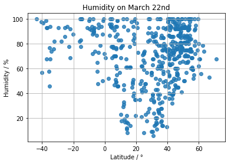
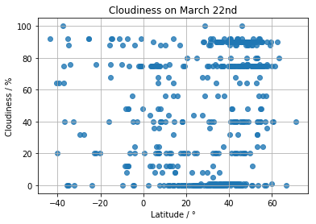

# WeatherPy
-----
## Analysis on March 22nd
* [Temperature - Latitude] Generally, getting closer to Equator tends to be higher temperature. But high temperature(over 80F) cities were also in around 0°(Equator) to North 40°. 
  

* [Humidity - Latitude] There was valiability in humidity in around North 10° to 40°  


* [Wind Speed - Latitude] Some cities in North 10° to 60° had strong wind greater than 20 mph. On the other hand, there was no city which wind speed was greater than 20 mph in the southern hemisphere.  


### Usage
1. get an API key from [Openweathermap](https://openweathermap.org/)
2. Edit `config.py`
3. run `jupytor notebook`
```
$ cd WeatherPY
$ jupyter notebook
```


```python
# Dependencies
import csv
import matplotlib.pyplot as plt
import numpy as np
import pandas as pd
import requests
import seaborn as sns

# Import API key
from config import api_key
```


```python
# Save config information
url = "http://api.openweathermap.org/data/2.5/weather?"
units = "imperial"

# Build partial query URL
query_url = f"{url}appid={api_key}&units={units}&q="
```

## Generate Cities List


```python
# Generate df of cities from the resource file from MaxMind https://www.maxmind.com/en/free-world-cities-database
cityList_df = pd.read_csv('resources/worldcitiespop.csv',encoding='ISO-8859-1', dtype={'Region': 'object'})
cityList_df.head()
```


<div>
<style>
    .dataframe thead tr:only-child th {
        text-align: right;
    }

    .dataframe thead th {
        text-align: left;
    }

    .dataframe tbody tr th {
        vertical-align: top;
    }
</style>
<table border="1" class="dataframe">
  <thead>
    <tr style="text-align: right;">
      <th></th>
      <th>Country</th>
      <th>City</th>
      <th>AccentCity</th>
      <th>Region</th>
      <th>Population</th>
      <th>Latitude</th>
      <th>Longitude</th>
    </tr>
  </thead>
  <tbody>
    <tr>
      <th>0</th>
      <td>ad</td>
      <td>aixas</td>
      <td>Aixàs</td>
      <td>06</td>
      <td>NaN</td>
      <td>42.483333</td>
      <td>1.466667</td>
    </tr>
    <tr>
      <th>1</th>
      <td>ad</td>
      <td>aixirivali</td>
      <td>Aixirivali</td>
      <td>06</td>
      <td>NaN</td>
      <td>42.466667</td>
      <td>1.500000</td>
    </tr>
    <tr>
      <th>2</th>
      <td>ad</td>
      <td>aixirivall</td>
      <td>Aixirivall</td>
      <td>06</td>
      <td>NaN</td>
      <td>42.466667</td>
      <td>1.500000</td>
    </tr>
    <tr>
      <th>3</th>
      <td>ad</td>
      <td>aixirvall</td>
      <td>Aixirvall</td>
      <td>06</td>
      <td>NaN</td>
      <td>42.466667</td>
      <td>1.500000</td>
    </tr>
    <tr>
      <th>4</th>
      <td>ad</td>
      <td>aixovall</td>
      <td>Aixovall</td>
      <td>06</td>
      <td>NaN</td>
      <td>42.466667</td>
      <td>1.483333</td>
    </tr>
  </tbody>
</table>
</div>


## Perform API Calls


```python
# Set empty lists
name = []
lat = []
temp = []
humid = []
cloud = []
wind = []

# Set counter
counter = 0

# Loop start
for x in np.arange(0, len(cityList_df.City), 2000):
    
    # Call openweathermap API
    response = requests.get(query_url + cityList_df.City[x]).json()
    
    # Process data when its code is 200
    if response['cod'] == 200:
        
        # Append each elemtnt to each list
        name.append(response['name'])
        lat.append(response['coord']['lat'])
        temp.append(response['main']['temp'])
        humid.append(response['main']['humidity'])
        cloud.append(response['clouds']['all'])
        wind.append(response['wind']['speed'])
        
        # Print result
        print('No.{}, name: {}, request_url: {}'.format(counter+1, response['name'], query_url + cityList_df.City[x]))
        
        # Increment counter
        counter +=1
```

    No.1, name: Gumbad, request_url: http://api.openweathermap.org/data/2.5/weather?appid=c809315dd014c3ef2a4c890abc2e9562&units=imperial&q=gumbad
    No.2, name: Karga, request_url: http://api.openweathermap.org/data/2.5/weather?appid=c809315dd014c3ef2a4c890abc2e9562&units=imperial&q=karga
    No.3, name: Muhmand, request_url: http://api.openweathermap.org/data/2.5/weather?appid=c809315dd014c3ef2a4c890abc2e9562&units=imperial&q=muhmand
    No.4, name: Qadir Khel, request_url: http://api.openweathermap.org/data/2.5/weather?appid=c809315dd014c3ef2a4c890abc2e9562&units=imperial&q=qadir khel
    No.5, name: Qaryah-ye Khurdzai, request_url: http://api.openweathermap.org/data/2.5/weather?appid=c809315dd014c3ef2a4c890abc2e9562&units=imperial&q=qaryah-ye khurdzai
    No.6, name: Rud, request_url: http://api.openweathermap.org/data/2.5/weather?appid=c809315dd014c3ef2a4c890abc2e9562&units=imperial&q=rud
    No.7, name: Sang Ab, request_url: http://api.openweathermap.org/data/2.5/weather?appid=c809315dd014c3ef2a4c890abc2e9562&units=imperial&q=sang ab
    No.8, name: Shur Tughay, request_url: http://api.openweathermap.org/data/2.5/weather?appid=c809315dd014c3ef2a4c890abc2e9562&units=imperial&q=shur tughay
    No.9, name: Ballaj, request_url: http://api.openweathermap.org/data/2.5/weather?appid=c809315dd014c3ef2a4c890abc2e9562&units=imperial&q=ballaj
    No.10, name: Pronovik, request_url: http://api.openweathermap.org/data/2.5/weather?appid=c809315dd014c3ef2a4c890abc2e9562&units=imperial&q=pronovik
    No.11, name: Huila, request_url: http://api.openweathermap.org/data/2.5/weather?appid=c809315dd014c3ef2a4c890abc2e9562&units=imperial&q=huila
    No.12, name: El Pueblito, request_url: http://api.openweathermap.org/data/2.5/weather?appid=c809315dd014c3ef2a4c890abc2e9562&units=imperial&q=el pueblito
    No.13, name: Punta Lara, request_url: http://api.openweathermap.org/data/2.5/weather?appid=c809315dd014c3ef2a4c890abc2e9562&units=imperial&q=punta lara
    No.14, name: Watt, request_url: http://api.openweathermap.org/data/2.5/weather?appid=c809315dd014c3ef2a4c890abc2e9562&units=imperial&q=watt
    No.15, name: Eis, request_url: http://api.openweathermap.org/data/2.5/weather?appid=c809315dd014c3ef2a4c890abc2e9562&units=imperial&q=eis
    No.16, name: Hals, request_url: http://api.openweathermap.org/data/2.5/weather?appid=c809315dd014c3ef2a4c890abc2e9562&units=imperial&q=hals
    No.17, name: Krenstetten, request_url: http://api.openweathermap.org/data/2.5/weather?appid=c809315dd014c3ef2a4c890abc2e9562&units=imperial&q=krenstetten
    No.18, name: Niederglobnitz, request_url: http://api.openweathermap.org/data/2.5/weather?appid=c809315dd014c3ef2a4c890abc2e9562&units=imperial&q=niederglobnitz
    No.19, name: Ratzenegg, request_url: http://api.openweathermap.org/data/2.5/weather?appid=c809315dd014c3ef2a4c890abc2e9562&units=imperial&q=ratzenegg
    No.20, name: Borambola, request_url: http://api.openweathermap.org/data/2.5/weather?appid=c809315dd014c3ef2a4c890abc2e9562&units=imperial&q=borambola
    No.21, name: Eidsvold, request_url: http://api.openweathermap.org/data/2.5/weather?appid=c809315dd014c3ef2a4c890abc2e9562&units=imperial&q=eidsvold
    No.22, name: Koondrook, request_url: http://api.openweathermap.org/data/2.5/weather?appid=c809315dd014c3ef2a4c890abc2e9562&units=imperial&q=koondrook
    No.23, name: Kumlu, request_url: http://api.openweathermap.org/data/2.5/weather?appid=c809315dd014c3ef2a4c890abc2e9562&units=imperial&q=kumlu
    No.24, name: Donja Barska, request_url: http://api.openweathermap.org/data/2.5/weather?appid=c809315dd014c3ef2a4c890abc2e9562&units=imperial&q=donja barska
    No.25, name: Gornji Grab, request_url: http://api.openweathermap.org/data/2.5/weather?appid=c809315dd014c3ef2a4c890abc2e9562&units=imperial&q=gornji grab
    No.26, name: Kokorina, request_url: http://api.openweathermap.org/data/2.5/weather?appid=c809315dd014c3ef2a4c890abc2e9562&units=imperial&q=kokorina
    No.27, name: Sitnica, request_url: http://api.openweathermap.org/data/2.5/weather?appid=c809315dd014c3ef2a4c890abc2e9562&units=imperial&q=sitnica
    No.28, name: Banshgari, request_url: http://api.openweathermap.org/data/2.5/weather?appid=c809315dd014c3ef2a4c890abc2e9562&units=imperial&q=banshgari
    No.29, name: Biala, request_url: http://api.openweathermap.org/data/2.5/weather?appid=c809315dd014c3ef2a4c890abc2e9562&units=imperial&q=biala
    No.30, name: Roypur, request_url: http://api.openweathermap.org/data/2.5/weather?appid=c809315dd014c3ef2a4c890abc2e9562&units=imperial&q=roypur
    No.31, name: West Khilpara, request_url: http://api.openweathermap.org/data/2.5/weather?appid=c809315dd014c3ef2a4c890abc2e9562&units=imperial&q=west khilpara
    No.32, name: Broechem, request_url: http://api.openweathermap.org/data/2.5/weather?appid=c809315dd014c3ef2a4c890abc2e9562&units=imperial&q=broechem
    No.33, name: Herseaux, request_url: http://api.openweathermap.org/data/2.5/weather?appid=c809315dd014c3ef2a4c890abc2e9562&units=imperial&q=herseaux
    No.34, name: Moere, request_url: http://api.openweathermap.org/data/2.5/weather?appid=c809315dd014c3ef2a4c890abc2e9562&units=imperial&q=moere
    No.35, name: Quevaucamps, request_url: http://api.openweathermap.org/data/2.5/weather?appid=c809315dd014c3ef2a4c890abc2e9562&units=imperial&q=quevaucamps
    No.36, name: Kasso, request_url: http://api.openweathermap.org/data/2.5/weather?appid=c809315dd014c3ef2a4c890abc2e9562&units=imperial&q=kasso
    No.37, name: Beli Lom, request_url: http://api.openweathermap.org/data/2.5/weather?appid=c809315dd014c3ef2a4c890abc2e9562&units=imperial&q=beli lom
    No.38, name: Chukilite, request_url: http://api.openweathermap.org/data/2.5/weather?appid=c809315dd014c3ef2a4c890abc2e9562&units=imperial&q=chukilite
    No.39, name: Iskril, request_url: http://api.openweathermap.org/data/2.5/weather?appid=c809315dd014c3ef2a4c890abc2e9562&units=imperial&q=iskril
    No.40, name: Malina, request_url: http://api.openweathermap.org/data/2.5/weather?appid=c809315dd014c3ef2a4c890abc2e9562&units=imperial&q=malina
    No.41, name: Salman, request_url: http://api.openweathermap.org/data/2.5/weather?appid=c809315dd014c3ef2a4c890abc2e9562&units=imperial&q=salman
    No.42, name: Svetoslavtsi, request_url: http://api.openweathermap.org/data/2.5/weather?appid=c809315dd014c3ef2a4c890abc2e9562&units=imperial&q=svetoslavtsi
    No.43, name: Kibimba, request_url: http://api.openweathermap.org/data/2.5/weather?appid=c809315dd014c3ef2a4c890abc2e9562&units=imperial&q=kibimba
    No.44, name: Abel, request_url: http://api.openweathermap.org/data/2.5/weather?appid=c809315dd014c3ef2a4c890abc2e9562&units=imperial&q=abel
    No.45, name: Aristides, request_url: http://api.openweathermap.org/data/2.5/weather?appid=c809315dd014c3ef2a4c890abc2e9562&units=imperial&q=aristides
    No.46, name: Barro, request_url: http://api.openweathermap.org/data/2.5/weather?appid=c809315dd014c3ef2a4c890abc2e9562&units=imperial&q=barro
    No.47, name: Carnaubeira, request_url: http://api.openweathermap.org/data/2.5/weather?appid=c809315dd014c3ef2a4c890abc2e9562&units=imperial&q=carnaubeira
    No.48, name: Cosmos, request_url: http://api.openweathermap.org/data/2.5/weather?appid=c809315dd014c3ef2a4c890abc2e9562&units=imperial&q=cosmos
    No.49, name: Genipapo, request_url: http://api.openweathermap.org/data/2.5/weather?appid=c809315dd014c3ef2a4c890abc2e9562&units=imperial&q=genipapo
    No.50, name: Martinopolis, request_url: http://api.openweathermap.org/data/2.5/weather?appid=c809315dd014c3ef2a4c890abc2e9562&units=imperial&q=martinopolis
    No.51, name: Pedrinhas, request_url: http://api.openweathermap.org/data/2.5/weather?appid=c809315dd014c3ef2a4c890abc2e9562&units=imperial&q=pedrinhas
    No.52, name: Rio Verde, request_url: http://api.openweathermap.org/data/2.5/weather?appid=c809315dd014c3ef2a4c890abc2e9562&units=imperial&q=rio verde
    No.53, name: Taiobeiras, request_url: http://api.openweathermap.org/data/2.5/weather?appid=c809315dd014c3ef2a4c890abc2e9562&units=imperial&q=taiobeiras
    No.54, name: Chashniki, request_url: http://api.openweathermap.org/data/2.5/weather?appid=c809315dd014c3ef2a4c890abc2e9562&units=imperial&q=chashniki
    No.55, name: Moshkovo, request_url: http://api.openweathermap.org/data/2.5/weather?appid=c809315dd014c3ef2a4c890abc2e9562&units=imperial&q=moshkovo
    No.56, name: Viry, request_url: http://api.openweathermap.org/data/2.5/weather?appid=c809315dd014c3ef2a4c890abc2e9562&units=imperial&q=viry
    No.57, name: Georgeville, request_url: http://api.openweathermap.org/data/2.5/weather?appid=c809315dd014c3ef2a4c890abc2e9562&units=imperial&q=georgeville
    No.58, name: Fort Steele, request_url: http://api.openweathermap.org/data/2.5/weather?appid=c809315dd014c3ef2a4c890abc2e9562&units=imperial&q=fort steele
    No.59, name: Pierson, request_url: http://api.openweathermap.org/data/2.5/weather?appid=c809315dd014c3ef2a4c890abc2e9562&units=imperial&q=pierson
    No.60, name: Black River, request_url: http://api.openweathermap.org/data/2.5/weather?appid=c809315dd014c3ef2a4c890abc2e9562&units=imperial&q=black river
    No.61, name: Kimbi, request_url: http://api.openweathermap.org/data/2.5/weather?appid=c809315dd014c3ef2a4c890abc2e9562&units=imperial&q=kimbi
    No.62, name: Ntadi, request_url: http://api.openweathermap.org/data/2.5/weather?appid=c809315dd014c3ef2a4c890abc2e9562&units=imperial&q=ntadi
    No.63, name: Bio, request_url: http://api.openweathermap.org/data/2.5/weather?appid=c809315dd014c3ef2a4c890abc2e9562&units=imperial&q=bio
    No.64, name: Koroko, request_url: http://api.openweathermap.org/data/2.5/weather?appid=c809315dd014c3ef2a4c890abc2e9562&units=imperial&q=koroko
    No.65, name: Mpody, request_url: http://api.openweathermap.org/data/2.5/weather?appid=c809315dd014c3ef2a4c890abc2e9562&units=imperial&q=mpody
    No.66, name: Wate, request_url: http://api.openweathermap.org/data/2.5/weather?appid=c809315dd014c3ef2a4c890abc2e9562&units=imperial&q=wate
    No.67, name: Badjoki, request_url: http://api.openweathermap.org/data/2.5/weather?appid=c809315dd014c3ef2a4c890abc2e9562&units=imperial&q=badjoki
    No.68, name: Ovangou, request_url: http://api.openweathermap.org/data/2.5/weather?appid=c809315dd014c3ef2a4c890abc2e9562&units=imperial&q=ovangou
    No.69, name: Ancun, request_url: http://api.openweathermap.org/data/2.5/weather?appid=c809315dd014c3ef2a4c890abc2e9562&units=imperial&q=ancun
    No.70, name: Baitou, request_url: http://api.openweathermap.org/data/2.5/weather?appid=c809315dd014c3ef2a4c890abc2e9562&units=imperial&q=baitou
    No.71, name: Bori, request_url: http://api.openweathermap.org/data/2.5/weather?appid=c809315dd014c3ef2a4c890abc2e9562&units=imperial&q=bori
    No.72, name: Chongxian, request_url: http://api.openweathermap.org/data/2.5/weather?appid=c809315dd014c3ef2a4c890abc2e9562&units=imperial&q=chongxian
    No.73, name: Dapingli, request_url: http://api.openweathermap.org/data/2.5/weather?appid=c809315dd014c3ef2a4c890abc2e9562&units=imperial&q=dapingli
    No.74, name: Eyang, request_url: http://api.openweathermap.org/data/2.5/weather?appid=c809315dd014c3ef2a4c890abc2e9562&units=imperial&q=eyang
    No.75, name: Guxian, request_url: http://api.openweathermap.org/data/2.5/weather?appid=c809315dd014c3ef2a4c890abc2e9562&units=imperial&q=guxian
    No.76, name: Huayang, request_url: http://api.openweathermap.org/data/2.5/weather?appid=c809315dd014c3ef2a4c890abc2e9562&units=imperial&q=huayang
    No.77, name: Jiantou, request_url: http://api.openweathermap.org/data/2.5/weather?appid=c809315dd014c3ef2a4c890abc2e9562&units=imperial&q=jiantou
    No.78, name: Laokouzhuang, request_url: http://api.openweathermap.org/data/2.5/weather?appid=c809315dd014c3ef2a4c890abc2e9562&units=imperial&q=laokouzhuang
    No.79, name: Lhabupu, request_url: http://api.openweathermap.org/data/2.5/weather?appid=c809315dd014c3ef2a4c890abc2e9562&units=imperial&q=lhabupu
    No.80, name: Liuta, request_url: http://api.openweathermap.org/data/2.5/weather?appid=c809315dd014c3ef2a4c890abc2e9562&units=imperial&q=liuta
    No.81, name: Madao, request_url: http://api.openweathermap.org/data/2.5/weather?appid=c809315dd014c3ef2a4c890abc2e9562&units=imperial&q=madao
    No.82, name: Nanwan, request_url: http://api.openweathermap.org/data/2.5/weather?appid=c809315dd014c3ef2a4c890abc2e9562&units=imperial&q=nanwan
    No.83, name: Panwa, request_url: http://api.openweathermap.org/data/2.5/weather?appid=c809315dd014c3ef2a4c890abc2e9562&units=imperial&q=panwa
    No.84, name: Qincun, request_url: http://api.openweathermap.org/data/2.5/weather?appid=c809315dd014c3ef2a4c890abc2e9562&units=imperial&q=qincun
    No.85, name: Sanfeng, request_url: http://api.openweathermap.org/data/2.5/weather?appid=c809315dd014c3ef2a4c890abc2e9562&units=imperial&q=sanfeng
    No.86, name: Sanxi, request_url: http://api.openweathermap.org/data/2.5/weather?appid=c809315dd014c3ef2a4c890abc2e9562&units=imperial&q=sanxi
    No.87, name: Shangoumen, request_url: http://api.openweathermap.org/data/2.5/weather?appid=c809315dd014c3ef2a4c890abc2e9562&units=imperial&q=shangoumen
    No.88, name: Shankou, request_url: http://api.openweathermap.org/data/2.5/weather?appid=c809315dd014c3ef2a4c890abc2e9562&units=imperial&q=shankou
    No.89, name: Shidi, request_url: http://api.openweathermap.org/data/2.5/weather?appid=c809315dd014c3ef2a4c890abc2e9562&units=imperial&q=shidi
    No.90, name: Shizhai, request_url: http://api.openweathermap.org/data/2.5/weather?appid=c809315dd014c3ef2a4c890abc2e9562&units=imperial&q=shizhai
    No.91, name: Suyang, request_url: http://api.openweathermap.org/data/2.5/weather?appid=c809315dd014c3ef2a4c890abc2e9562&units=imperial&q=suyang
    No.92, name: Tangyu, request_url: http://api.openweathermap.org/data/2.5/weather?appid=c809315dd014c3ef2a4c890abc2e9562&units=imperial&q=tangyu
    No.93, name: Weiping, request_url: http://api.openweathermap.org/data/2.5/weather?appid=c809315dd014c3ef2a4c890abc2e9562&units=imperial&q=weiping
    No.94, name: Wushikeng, request_url: http://api.openweathermap.org/data/2.5/weather?appid=c809315dd014c3ef2a4c890abc2e9562&units=imperial&q=wushikeng
    No.95, name: Xintian, request_url: http://api.openweathermap.org/data/2.5/weather?appid=c809315dd014c3ef2a4c890abc2e9562&units=imperial&q=xintian
    No.96, name: Xuzhuang, request_url: http://api.openweathermap.org/data/2.5/weather?appid=c809315dd014c3ef2a4c890abc2e9562&units=imperial&q=xuzhuang
    No.97, name: Yangjiapeng, request_url: http://api.openweathermap.org/data/2.5/weather?appid=c809315dd014c3ef2a4c890abc2e9562&units=imperial&q=yangjiapeng
    No.98, name: Zhangwan, request_url: http://api.openweathermap.org/data/2.5/weather?appid=c809315dd014c3ef2a4c890abc2e9562&units=imperial&q=zhangwan
    No.99, name: Esmeralda, request_url: http://api.openweathermap.org/data/2.5/weather?appid=c809315dd014c3ef2a4c890abc2e9562&units=imperial&q=esmeralda
    No.100, name: Los Lobos, request_url: http://api.openweathermap.org/data/2.5/weather?appid=c809315dd014c3ef2a4c890abc2e9562&units=imperial&q=los lobos
    No.101, name: Navidad, request_url: http://api.openweathermap.org/data/2.5/weather?appid=c809315dd014c3ef2a4c890abc2e9562&units=imperial&q=navidad
    No.102, name: Pradilla, request_url: http://api.openweathermap.org/data/2.5/weather?appid=c809315dd014c3ef2a4c890abc2e9562&units=imperial&q=pradilla
    No.103, name: San Ignacio, request_url: http://api.openweathermap.org/data/2.5/weather?appid=c809315dd014c3ef2a4c890abc2e9562&units=imperial&q=san ignacio
    No.104, name: Tienda Nueva, request_url: http://api.openweathermap.org/data/2.5/weather?appid=c809315dd014c3ef2a4c890abc2e9562&units=imperial&q=tienda nueva
    No.105, name: Corral Nuevo, request_url: http://api.openweathermap.org/data/2.5/weather?appid=c809315dd014c3ef2a4c890abc2e9562&units=imperial&q=corral nuevo
    No.106, name: San Agustin, request_url: http://api.openweathermap.org/data/2.5/weather?appid=c809315dd014c3ef2a4c890abc2e9562&units=imperial&q=san agustin
    No.107, name: Holenice, request_url: http://api.openweathermap.org/data/2.5/weather?appid=c809315dd014c3ef2a4c890abc2e9562&units=imperial&q=holenice
    No.108, name: Kirchschlag, request_url: http://api.openweathermap.org/data/2.5/weather?appid=c809315dd014c3ef2a4c890abc2e9562&units=imperial&q=kirchschlag
    No.109, name: Libcice nad Vltavou, request_url: http://api.openweathermap.org/data/2.5/weather?appid=c809315dd014c3ef2a4c890abc2e9562&units=imperial&q=libcice nad vltavou
    No.110, name: Pardubice, request_url: http://api.openweathermap.org/data/2.5/weather?appid=c809315dd014c3ef2a4c890abc2e9562&units=imperial&q=pardubice
    No.111, name: Vahlovice, request_url: http://api.openweathermap.org/data/2.5/weather?appid=c809315dd014c3ef2a4c890abc2e9562&units=imperial&q=vahlovice
    No.112, name: Zdislavice, request_url: http://api.openweathermap.org/data/2.5/weather?appid=c809315dd014c3ef2a4c890abc2e9562&units=imperial&q=zdislavice
    No.113, name: Alt Steinbeck, request_url: http://api.openweathermap.org/data/2.5/weather?appid=c809315dd014c3ef2a4c890abc2e9562&units=imperial&q=alt steinbeck
    No.114, name: Birkenwerder, request_url: http://api.openweathermap.org/data/2.5/weather?appid=c809315dd014c3ef2a4c890abc2e9562&units=imperial&q=birkenwerder
    No.115, name: Brenschede, request_url: http://api.openweathermap.org/data/2.5/weather?appid=c809315dd014c3ef2a4c890abc2e9562&units=imperial&q=brenschede
    No.116, name: Cunnersdorf, request_url: http://api.openweathermap.org/data/2.5/weather?appid=c809315dd014c3ef2a4c890abc2e9562&units=imperial&q=cunnersdorf
    No.117, name: Ellerding, request_url: http://api.openweathermap.org/data/2.5/weather?appid=c809315dd014c3ef2a4c890abc2e9562&units=imperial&q=ellerding
    No.118, name: Gedern, request_url: http://api.openweathermap.org/data/2.5/weather?appid=c809315dd014c3ef2a4c890abc2e9562&units=imperial&q=gedern
    No.119, name: Gramzow, request_url: http://api.openweathermap.org/data/2.5/weather?appid=c809315dd014c3ef2a4c890abc2e9562&units=imperial&q=gramzow
    No.120, name: Guntersdorf, request_url: http://api.openweathermap.org/data/2.5/weather?appid=c809315dd014c3ef2a4c890abc2e9562&units=imperial&q=guntersdorf
    No.121, name: Heblos, request_url: http://api.openweathermap.org/data/2.5/weather?appid=c809315dd014c3ef2a4c890abc2e9562&units=imperial&q=heblos
    No.122, name: Hugoldsdorf, request_url: http://api.openweathermap.org/data/2.5/weather?appid=c809315dd014c3ef2a4c890abc2e9562&units=imperial&q=hugoldsdorf
    No.123, name: Lausheim, request_url: http://api.openweathermap.org/data/2.5/weather?appid=c809315dd014c3ef2a4c890abc2e9562&units=imperial&q=lausheim
    No.124, name: Lucherberg, request_url: http://api.openweathermap.org/data/2.5/weather?appid=c809315dd014c3ef2a4c890abc2e9562&units=imperial&q=lucherberg
    No.125, name: Meringerzell, request_url: http://api.openweathermap.org/data/2.5/weather?appid=c809315dd014c3ef2a4c890abc2e9562&units=imperial&q=meringerzell
    No.126, name: Naabdemenreuth, request_url: http://api.openweathermap.org/data/2.5/weather?appid=c809315dd014c3ef2a4c890abc2e9562&units=imperial&q=naabdemenreuth
    No.127, name: Osterforde, request_url: http://api.openweathermap.org/data/2.5/weather?appid=c809315dd014c3ef2a4c890abc2e9562&units=imperial&q=osterforde
    No.128, name: Prag, request_url: http://api.openweathermap.org/data/2.5/weather?appid=c809315dd014c3ef2a4c890abc2e9562&units=imperial&q=prag
    No.129, name: Ruppersbach, request_url: http://api.openweathermap.org/data/2.5/weather?appid=c809315dd014c3ef2a4c890abc2e9562&units=imperial&q=ruppersbach
    No.130, name: Schmidthausen, request_url: http://api.openweathermap.org/data/2.5/weather?appid=c809315dd014c3ef2a4c890abc2e9562&units=imperial&q=schmidthausen
    No.131, name: Stettenhofen, request_url: http://api.openweathermap.org/data/2.5/weather?appid=c809315dd014c3ef2a4c890abc2e9562&units=imperial&q=stettenhofen
    No.132, name: Waltringhausen, request_url: http://api.openweathermap.org/data/2.5/weather?appid=c809315dd014c3ef2a4c890abc2e9562&units=imperial&q=waltringhausen
    No.133, name: Wiederberg, request_url: http://api.openweathermap.org/data/2.5/weather?appid=c809315dd014c3ef2a4c890abc2e9562&units=imperial&q=wiederberg
    No.134, name: Zabitz, request_url: http://api.openweathermap.org/data/2.5/weather?appid=c809315dd014c3ef2a4c890abc2e9562&units=imperial&q=zabitz
    No.135, name: Hollensted, request_url: http://api.openweathermap.org/data/2.5/weather?appid=c809315dd014c3ef2a4c890abc2e9562&units=imperial&q=hollensted
    No.136, name: Las Canitas, request_url: http://api.openweathermap.org/data/2.5/weather?appid=c809315dd014c3ef2a4c890abc2e9562&units=imperial&q=las canitas
    No.137, name: Zarouria, request_url: http://api.openweathermap.org/data/2.5/weather?appid=c809315dd014c3ef2a4c890abc2e9562&units=imperial&q=zarouria
    No.138, name: El Plateado, request_url: http://api.openweathermap.org/data/2.5/weather?appid=c809315dd014c3ef2a4c890abc2e9562&units=imperial&q=el plateado
    No.139, name: Hacienda Vieja, request_url: http://api.openweathermap.org/data/2.5/weather?appid=c809315dd014c3ef2a4c890abc2e9562&units=imperial&q=hacienda vieja
    No.140, name: Pichil, request_url: http://api.openweathermap.org/data/2.5/weather?appid=c809315dd014c3ef2a4c890abc2e9562&units=imperial&q=pichil
    No.141, name: Tagakolga, request_url: http://api.openweathermap.org/data/2.5/weather?appid=c809315dd014c3ef2a4c890abc2e9562&units=imperial&q=tagakolga
    No.142, name: Abu Ruweish, request_url: http://api.openweathermap.org/data/2.5/weather?appid=c809315dd014c3ef2a4c890abc2e9562&units=imperial&q=abu ruweish
    No.143, name: Itsa, request_url: http://api.openweathermap.org/data/2.5/weather?appid=c809315dd014c3ef2a4c890abc2e9562&units=imperial&q=itsa
    No.144, name: Kafr al Ahrar, request_url: http://api.openweathermap.org/data/2.5/weather?appid=c809315dd014c3ef2a4c890abc2e9562&units=imperial&q=kafr al ahrar
    No.145, name: La Vega, request_url: http://api.openweathermap.org/data/2.5/weather?appid=c809315dd014c3ef2a4c890abc2e9562&units=imperial&q=la vega
    No.146, name: Onsares, request_url: http://api.openweathermap.org/data/2.5/weather?appid=c809315dd014c3ef2a4c890abc2e9562&units=imperial&q=onsares
    No.147, name: Valenza, request_url: http://api.openweathermap.org/data/2.5/weather?appid=c809315dd014c3ef2a4c890abc2e9562&units=imperial&q=valenza
    No.148, name: Villegar, request_url: http://api.openweathermap.org/data/2.5/weather?appid=c809315dd014c3ef2a4c890abc2e9562&units=imperial&q=villegar
    No.149, name: Anttila, request_url: http://api.openweathermap.org/data/2.5/weather?appid=c809315dd014c3ef2a4c890abc2e9562&units=imperial&q=anttila
    No.150, name: Saltvik, request_url: http://api.openweathermap.org/data/2.5/weather?appid=c809315dd014c3ef2a4c890abc2e9562&units=imperial&q=saltvik
    No.151, name: Ulkuniemi, request_url: http://api.openweathermap.org/data/2.5/weather?appid=c809315dd014c3ef2a4c890abc2e9562&units=imperial&q=ulkuniemi
    No.152, name: Arveyres, request_url: http://api.openweathermap.org/data/2.5/weather?appid=c809315dd014c3ef2a4c890abc2e9562&units=imperial&q=arveyres
    No.153, name: Boersch, request_url: http://api.openweathermap.org/data/2.5/weather?appid=c809315dd014c3ef2a4c890abc2e9562&units=imperial&q=boersch
    No.154, name: Brocourt-en-Argonne, request_url: http://api.openweathermap.org/data/2.5/weather?appid=c809315dd014c3ef2a4c890abc2e9562&units=imperial&q=brocourt-en-argonne
    No.155, name: Coudehard, request_url: http://api.openweathermap.org/data/2.5/weather?appid=c809315dd014c3ef2a4c890abc2e9562&units=imperial&q=coudehard
    No.156, name: Dompierre, request_url: http://api.openweathermap.org/data/2.5/weather?appid=c809315dd014c3ef2a4c890abc2e9562&units=imperial&q=dompierre
    No.157, name: Fay-en-Montagne, request_url: http://api.openweathermap.org/data/2.5/weather?appid=c809315dd014c3ef2a4c890abc2e9562&units=imperial&q=fay-en-montagne
    No.158, name: Garnier, request_url: http://api.openweathermap.org/data/2.5/weather?appid=c809315dd014c3ef2a4c890abc2e9562&units=imperial&q=garnier
    No.159, name: Hablainville, request_url: http://api.openweathermap.org/data/2.5/weather?appid=c809315dd014c3ef2a4c890abc2e9562&units=imperial&q=hablainville
    No.160, name: Laveau, request_url: http://api.openweathermap.org/data/2.5/weather?appid=c809315dd014c3ef2a4c890abc2e9562&units=imperial&q=laveau
    No.161, name: Les Souillats, request_url: http://api.openweathermap.org/data/2.5/weather?appid=c809315dd014c3ef2a4c890abc2e9562&units=imperial&q=les souillats
    No.162, name: Matignicourt-Goncourt, request_url: http://api.openweathermap.org/data/2.5/weather?appid=c809315dd014c3ef2a4c890abc2e9562&units=imperial&q=matignicourt-goncourt
    No.163, name: Montauban-de-Luchon, request_url: http://api.openweathermap.org/data/2.5/weather?appid=c809315dd014c3ef2a4c890abc2e9562&units=imperial&q=montauban-de-luchon
    No.164, name: Nay, request_url: http://api.openweathermap.org/data/2.5/weather?appid=c809315dd014c3ef2a4c890abc2e9562&units=imperial&q=nay
    No.165, name: Paray-le-Monial, request_url: http://api.openweathermap.org/data/2.5/weather?appid=c809315dd014c3ef2a4c890abc2e9562&units=imperial&q=paray-le-monial
    No.166, name: Recques-sur-Hem, request_url: http://api.openweathermap.org/data/2.5/weather?appid=c809315dd014c3ef2a4c890abc2e9562&units=imperial&q=recques-sur-hem
    No.167, name: Saint-Fulgent, request_url: http://api.openweathermap.org/data/2.5/weather?appid=c809315dd014c3ef2a4c890abc2e9562&units=imperial&q=saint-fulgent
    No.168, name: Saint-Martin, request_url: http://api.openweathermap.org/data/2.5/weather?appid=c809315dd014c3ef2a4c890abc2e9562&units=imperial&q=saint-martin
    No.169, name: Saligney, request_url: http://api.openweathermap.org/data/2.5/weather?appid=c809315dd014c3ef2a4c890abc2e9562&units=imperial&q=saligney
    No.170, name: Beverston, request_url: http://api.openweathermap.org/data/2.5/weather?appid=c809315dd014c3ef2a4c890abc2e9562&units=imperial&q=beverston
    No.171, name: City of Belfast, request_url: http://api.openweathermap.org/data/2.5/weather?appid=c809315dd014c3ef2a4c890abc2e9562&units=imperial&q=city of belfast
    No.172, name: Egton, request_url: http://api.openweathermap.org/data/2.5/weather?appid=c809315dd014c3ef2a4c890abc2e9562&units=imperial&q=egton
    No.173, name: Henfynyw Upper, request_url: http://api.openweathermap.org/data/2.5/weather?appid=c809315dd014c3ef2a4c890abc2e9562&units=imperial&q=henfynyw upper
    No.174, name: Little Chesterford, request_url: http://api.openweathermap.org/data/2.5/weather?appid=c809315dd014c3ef2a4c890abc2e9562&units=imperial&q=little chesterford
    No.175, name: Rye Harbour, request_url: http://api.openweathermap.org/data/2.5/weather?appid=c809315dd014c3ef2a4c890abc2e9562&units=imperial&q=rye harbour
    No.176, name: Theale, request_url: http://api.openweathermap.org/data/2.5/weather?appid=c809315dd014c3ef2a4c890abc2e9562&units=imperial&q=theale
    No.177, name: Wormington, request_url: http://api.openweathermap.org/data/2.5/weather?appid=c809315dd014c3ef2a4c890abc2e9562&units=imperial&q=wormington
    No.178, name: Agadji, request_url: http://api.openweathermap.org/data/2.5/weather?appid=c809315dd014c3ef2a4c890abc2e9562&units=imperial&q=agadji
    No.179, name: Damang, request_url: http://api.openweathermap.org/data/2.5/weather?appid=c809315dd014c3ef2a4c890abc2e9562&units=imperial&q=damang
    No.180, name: Song, request_url: http://api.openweathermap.org/data/2.5/weather?appid=c809315dd014c3ef2a4c890abc2e9562&units=imperial&q=song
    No.181, name: Mansal, request_url: http://api.openweathermap.org/data/2.5/weather?appid=c809315dd014c3ef2a4c890abc2e9562&units=imperial&q=mansal
    No.182, name: Avas, request_url: http://api.openweathermap.org/data/2.5/weather?appid=c809315dd014c3ef2a4c890abc2e9562&units=imperial&q=avas
    No.183, name: Kato Khorion, request_url: http://api.openweathermap.org/data/2.5/weather?appid=c809315dd014c3ef2a4c890abc2e9562&units=imperial&q=kato khorion
    No.184, name: Lagunilla, request_url: http://api.openweathermap.org/data/2.5/weather?appid=c809315dd014c3ef2a4c890abc2e9562&units=imperial&q=lagunilla
    No.185, name: Rincon, request_url: http://api.openweathermap.org/data/2.5/weather?appid=c809315dd014c3ef2a4c890abc2e9562&units=imperial&q=rincon
    No.186, name: El Limon, request_url: http://api.openweathermap.org/data/2.5/weather?appid=c809315dd014c3ef2a4c890abc2e9562&units=imperial&q=el limon
    No.187, name: Piedra Pintada, request_url: http://api.openweathermap.org/data/2.5/weather?appid=c809315dd014c3ef2a4c890abc2e9562&units=imperial&q=piedra pintada
    No.188, name: Brnjica, request_url: http://api.openweathermap.org/data/2.5/weather?appid=c809315dd014c3ef2a4c890abc2e9562&units=imperial&q=brnjica
    No.189, name: Godinjak, request_url: http://api.openweathermap.org/data/2.5/weather?appid=c809315dd014c3ef2a4c890abc2e9562&units=imperial&q=godinjak
    No.190, name: Velika Vranovina, request_url: http://api.openweathermap.org/data/2.5/weather?appid=c809315dd014c3ef2a4c890abc2e9562&units=imperial&q=velika vranovina
    No.191, name: Boidine, request_url: http://api.openweathermap.org/data/2.5/weather?appid=c809315dd014c3ef2a4c890abc2e9562&units=imperial&q=boidine
    No.192, name: Danby, request_url: http://api.openweathermap.org/data/2.5/weather?appid=c809315dd014c3ef2a4c890abc2e9562&units=imperial&q=danby
    No.193, name: Libickozma, request_url: http://api.openweathermap.org/data/2.5/weather?appid=c809315dd014c3ef2a4c890abc2e9562&units=imperial&q=libickozma
    No.194, name: Bendung, request_url: http://api.openweathermap.org/data/2.5/weather?appid=c809315dd014c3ef2a4c890abc2e9562&units=imperial&q=bendung
    No.195, name: Boras, request_url: http://api.openweathermap.org/data/2.5/weather?appid=c809315dd014c3ef2a4c890abc2e9562&units=imperial&q=boras
    No.196, name: Bulangan, request_url: http://api.openweathermap.org/data/2.5/weather?appid=c809315dd014c3ef2a4c890abc2e9562&units=imperial&q=bulangan
    No.197, name: Gara, request_url: http://api.openweathermap.org/data/2.5/weather?appid=c809315dd014c3ef2a4c890abc2e9562&units=imperial&q=gara
    No.198, name: Igot, request_url: http://api.openweathermap.org/data/2.5/weather?appid=c809315dd014c3ef2a4c890abc2e9562&units=imperial&q=igot
    No.199, name: Karangjaya, request_url: http://api.openweathermap.org/data/2.5/weather?appid=c809315dd014c3ef2a4c890abc2e9562&units=imperial&q=karangjaya
    No.200, name: Kemirimuka, request_url: http://api.openweathermap.org/data/2.5/weather?appid=c809315dd014c3ef2a4c890abc2e9562&units=imperial&q=kemirimuka
    No.201, name: Koja, request_url: http://api.openweathermap.org/data/2.5/weather?appid=c809315dd014c3ef2a4c890abc2e9562&units=imperial&q=koja
    No.202, name: Lalimbue, request_url: http://api.openweathermap.org/data/2.5/weather?appid=c809315dd014c3ef2a4c890abc2e9562&units=imperial&q=lalimbue
    No.203, name: Mariah Dolok, request_url: http://api.openweathermap.org/data/2.5/weather?appid=c809315dd014c3ef2a4c890abc2e9562&units=imperial&q=mariah dolok
    No.204, name: Mugassari, request_url: http://api.openweathermap.org/data/2.5/weather?appid=c809315dd014c3ef2a4c890abc2e9562&units=imperial&q=mugassari
    No.205, name: Payung, request_url: http://api.openweathermap.org/data/2.5/weather?appid=c809315dd014c3ef2a4c890abc2e9562&units=imperial&q=payung
    No.206, name: Praingkareha, request_url: http://api.openweathermap.org/data/2.5/weather?appid=c809315dd014c3ef2a4c890abc2e9562&units=imperial&q=praingkareha
    No.207, name: Rejosari, request_url: http://api.openweathermap.org/data/2.5/weather?appid=c809315dd014c3ef2a4c890abc2e9562&units=imperial&q=rejosari
    No.208, name: Tanggobu Dua, request_url: http://api.openweathermap.org/data/2.5/weather?appid=c809315dd014c3ef2a4c890abc2e9562&units=imperial&q=tanggobu dua
    No.209, name: Temba, request_url: http://api.openweathermap.org/data/2.5/weather?appid=c809315dd014c3ef2a4c890abc2e9562&units=imperial&q=temba
    No.210, name: Ballylusky, request_url: http://api.openweathermap.org/data/2.5/weather?appid=c809315dd014c3ef2a4c890abc2e9562&units=imperial&q=ballylusky
    No.211, name: Grange, request_url: http://api.openweathermap.org/data/2.5/weather?appid=c809315dd014c3ef2a4c890abc2e9562&units=imperial&q=grange
    No.212, name: Adwal, request_url: http://api.openweathermap.org/data/2.5/weather?appid=c809315dd014c3ef2a4c890abc2e9562&units=imperial&q=adwal
    No.213, name: Bahadarpur, request_url: http://api.openweathermap.org/data/2.5/weather?appid=c809315dd014c3ef2a4c890abc2e9562&units=imperial&q=bahadarpur
    No.214, name: Chitri, request_url: http://api.openweathermap.org/data/2.5/weather?appid=c809315dd014c3ef2a4c890abc2e9562&units=imperial&q=chitri
    No.215, name: Dhirpur, request_url: http://api.openweathermap.org/data/2.5/weather?appid=c809315dd014c3ef2a4c890abc2e9562&units=imperial&q=dhirpur
    No.216, name: Hawrah, request_url: http://api.openweathermap.org/data/2.5/weather?appid=c809315dd014c3ef2a4c890abc2e9562&units=imperial&q=hawrah
    No.217, name: Mathura, request_url: http://api.openweathermap.org/data/2.5/weather?appid=c809315dd014c3ef2a4c890abc2e9562&units=imperial&q=mathura
    No.218, name: Suratgarh, request_url: http://api.openweathermap.org/data/2.5/weather?appid=c809315dd014c3ef2a4c890abc2e9562&units=imperial&q=suratgarh
    No.219, name: Udal Walla, request_url: http://api.openweathermap.org/data/2.5/weather?appid=c809315dd014c3ef2a4c890abc2e9562&units=imperial&q=udal walla
    No.220, name: Abu Gharib, request_url: http://api.openweathermap.org/data/2.5/weather?appid=c809315dd014c3ef2a4c890abc2e9562&units=imperial&q=abu gharib
    No.221, name: Ash Shatrah, request_url: http://api.openweathermap.org/data/2.5/weather?appid=c809315dd014c3ef2a4c890abc2e9562&units=imperial&q=ash shatrah
    No.222, name: Qaryat al Fudayli, request_url: http://api.openweathermap.org/data/2.5/weather?appid=c809315dd014c3ef2a4c890abc2e9562&units=imperial&q=qaryat al fudayli
    No.223, name: Chenar, request_url: http://api.openweathermap.org/data/2.5/weather?appid=c809315dd014c3ef2a4c890abc2e9562&units=imperial&q=chenar
    No.224, name: Fathabad, request_url: http://api.openweathermap.org/data/2.5/weather?appid=c809315dd014c3ef2a4c890abc2e9562&units=imperial&q=fathabad
    No.225, name: Hosen, request_url: http://api.openweathermap.org/data/2.5/weather?appid=c809315dd014c3ef2a4c890abc2e9562&units=imperial&q=hosen
    No.226, name: Kamalabad, request_url: http://api.openweathermap.org/data/2.5/weather?appid=c809315dd014c3ef2a4c890abc2e9562&units=imperial&q=kamalabad
    No.227, name: Kuchek, request_url: http://api.openweathermap.org/data/2.5/weather?appid=c809315dd014c3ef2a4c890abc2e9562&units=imperial&q=kuchek
    No.228, name: Nurabad, request_url: http://api.openweathermap.org/data/2.5/weather?appid=c809315dd014c3ef2a4c890abc2e9562&units=imperial&q=nurabad
    No.229, name: Somba, request_url: http://api.openweathermap.org/data/2.5/weather?appid=c809315dd014c3ef2a4c890abc2e9562&units=imperial&q=somba
    No.230, name: Antella, request_url: http://api.openweathermap.org/data/2.5/weather?appid=c809315dd014c3ef2a4c890abc2e9562&units=imperial&q=antella
    No.231, name: Camerata, request_url: http://api.openweathermap.org/data/2.5/weather?appid=c809315dd014c3ef2a4c890abc2e9562&units=imperial&q=camerata
    No.232, name: Castello del Lago, request_url: http://api.openweathermap.org/data/2.5/weather?appid=c809315dd014c3ef2a4c890abc2e9562&units=imperial&q=castello del lago
    No.233, name: Dasindo, request_url: http://api.openweathermap.org/data/2.5/weather?appid=c809315dd014c3ef2a4c890abc2e9562&units=imperial&q=dasindo
    No.234, name: I Forni, request_url: http://api.openweathermap.org/data/2.5/weather?appid=c809315dd014c3ef2a4c890abc2e9562&units=imperial&q=i forni
    No.235, name: Palazzone, request_url: http://api.openweathermap.org/data/2.5/weather?appid=c809315dd014c3ef2a4c890abc2e9562&units=imperial&q=palazzone
    No.236, name: Raccolana, request_url: http://api.openweathermap.org/data/2.5/weather?appid=c809315dd014c3ef2a4c890abc2e9562&units=imperial&q=raccolana
    No.237, name: San Salvo, request_url: http://api.openweathermap.org/data/2.5/weather?appid=c809315dd014c3ef2a4c890abc2e9562&units=imperial&q=san salvo
    No.238, name: Zermeghedo, request_url: http://api.openweathermap.org/data/2.5/weather?appid=c809315dd014c3ef2a4c890abc2e9562&units=imperial&q=zermeghedo
    No.239, name: Khirbat al Kawm, request_url: http://api.openweathermap.org/data/2.5/weather?appid=c809315dd014c3ef2a4c890abc2e9562&units=imperial&q=khirbat al kawm
    No.240, name: Hiraizumi, request_url: http://api.openweathermap.org/data/2.5/weather?appid=c809315dd014c3ef2a4c890abc2e9562&units=imperial&q=hiraizumi
    No.241, name: Koshika, request_url: http://api.openweathermap.org/data/2.5/weather?appid=c809315dd014c3ef2a4c890abc2e9562&units=imperial&q=koshika
    No.242, name: Mugi, request_url: http://api.openweathermap.org/data/2.5/weather?appid=c809315dd014c3ef2a4c890abc2e9562&units=imperial&q=mugi
    No.243, name: Ohara, request_url: http://api.openweathermap.org/data/2.5/weather?appid=c809315dd014c3ef2a4c890abc2e9562&units=imperial&q=ohara
    No.244, name: Tari, request_url: http://api.openweathermap.org/data/2.5/weather?appid=c809315dd014c3ef2a4c890abc2e9562&units=imperial&q=tari
    No.245, name: Kileleshwa, request_url: http://api.openweathermap.org/data/2.5/weather?appid=c809315dd014c3ef2a4c890abc2e9562&units=imperial&q=kileleshwa
    No.246, name: Kobela, request_url: http://api.openweathermap.org/data/2.5/weather?appid=c809315dd014c3ef2a4c890abc2e9562&units=imperial&q=kobela
    No.247, name: Hupori, request_url: http://api.openweathermap.org/data/2.5/weather?appid=c809315dd014c3ef2a4c890abc2e9562&units=imperial&q=hupori
    No.248, name: Sopo, request_url: http://api.openweathermap.org/data/2.5/weather?appid=c809315dd014c3ef2a4c890abc2e9562&units=imperial&q=sopo
    No.249, name: Ozernoe, request_url: http://api.openweathermap.org/data/2.5/weather?appid=c809315dd014c3ef2a4c890abc2e9562&units=imperial&q=ozernoe
    No.250, name: Uzynkol', request_url: http://api.openweathermap.org/data/2.5/weather?appid=c809315dd014c3ef2a4c890abc2e9562&units=imperial&q=uzynkol'
    No.251, name: Ban Nongboua, request_url: http://api.openweathermap.org/data/2.5/weather?appid=c809315dd014c3ef2a4c890abc2e9562&units=imperial&q=ban nongboua
    No.252, name: Atigala, request_url: http://api.openweathermap.org/data/2.5/weather?appid=c809315dd014c3ef2a4c890abc2e9562&units=imperial&q=atigala
    No.253, name: Morape, request_url: http://api.openweathermap.org/data/2.5/weather?appid=c809315dd014c3ef2a4c890abc2e9562&units=imperial&q=morape
    No.254, name: Pamunuwa, request_url: http://api.openweathermap.org/data/2.5/weather?appid=c809315dd014c3ef2a4c890abc2e9562&units=imperial&q=pamunuwa
    No.255, name: Kirkliai, request_url: http://api.openweathermap.org/data/2.5/weather?appid=c809315dd014c3ef2a4c890abc2e9562&units=imperial&q=kirkliai
    No.256, name: Paluobiai, request_url: http://api.openweathermap.org/data/2.5/weather?appid=c809315dd014c3ef2a4c890abc2e9562&units=imperial&q=paluobiai
    No.257, name: Stirniene, request_url: http://api.openweathermap.org/data/2.5/weather?appid=c809315dd014c3ef2a4c890abc2e9562&units=imperial&q=stirniene
    No.258, name: Oulad Naseur, request_url: http://api.openweathermap.org/data/2.5/weather?appid=c809315dd014c3ef2a4c890abc2e9562&units=imperial&q=oulad naseur
    No.259, name: Lazine, request_url: http://api.openweathermap.org/data/2.5/weather?appid=c809315dd014c3ef2a4c890abc2e9562&units=imperial&q=lazine
    No.260, name: Klenoec, request_url: http://api.openweathermap.org/data/2.5/weather?appid=c809315dd014c3ef2a4c890abc2e9562&units=imperial&q=klenoec
    No.261, name: Gao, request_url: http://api.openweathermap.org/data/2.5/weather?appid=c809315dd014c3ef2a4c890abc2e9562&units=imperial&q=gao
    No.262, name: Ponna, request_url: http://api.openweathermap.org/data/2.5/weather?appid=c809315dd014c3ef2a4c890abc2e9562&units=imperial&q=ponna
    No.263, name: Ahuacatlan, request_url: http://api.openweathermap.org/data/2.5/weather?appid=c809315dd014c3ef2a4c890abc2e9562&units=imperial&q=ahuacatlan
    No.264, name: Ayotusco, request_url: http://api.openweathermap.org/data/2.5/weather?appid=c809315dd014c3ef2a4c890abc2e9562&units=imperial&q=ayotusco
    No.265, name: Cacao, request_url: http://api.openweathermap.org/data/2.5/weather?appid=c809315dd014c3ef2a4c890abc2e9562&units=imperial&q=cacao
    No.266, name: El alamo, request_url: http://api.openweathermap.org/data/2.5/weather?appid=c809315dd014c3ef2a4c890abc2e9562&units=imperial&q=el alamo
    No.267, name: El Encino, request_url: http://api.openweathermap.org/data/2.5/weather?appid=c809315dd014c3ef2a4c890abc2e9562&units=imperial&q=el encino
    No.268, name: El Penasco, request_url: http://api.openweathermap.org/data/2.5/weather?appid=c809315dd014c3ef2a4c890abc2e9562&units=imperial&q=el penasco
    No.269, name: El Venado, request_url: http://api.openweathermap.org/data/2.5/weather?appid=c809315dd014c3ef2a4c890abc2e9562&units=imperial&q=el venado
    No.270, name: Ignacio Manuel Altamirano, request_url: http://api.openweathermap.org/data/2.5/weather?appid=c809315dd014c3ef2a4c890abc2e9562&units=imperial&q=ignacio manuel altamirano
    No.271, name: Laja, request_url: http://api.openweathermap.org/data/2.5/weather?appid=c809315dd014c3ef2a4c890abc2e9562&units=imperial&q=laja
    No.272, name: Las Blancas, request_url: http://api.openweathermap.org/data/2.5/weather?appid=c809315dd014c3ef2a4c890abc2e9562&units=imperial&q=las blancas
    No.273, name: La Zanja, request_url: http://api.openweathermap.org/data/2.5/weather?appid=c809315dd014c3ef2a4c890abc2e9562&units=imperial&q=la zanja
    No.274, name: Los Negritos, request_url: http://api.openweathermap.org/data/2.5/weather?appid=c809315dd014c3ef2a4c890abc2e9562&units=imperial&q=los negritos
    No.275, name: Quinta, request_url: http://api.openweathermap.org/data/2.5/weather?appid=c809315dd014c3ef2a4c890abc2e9562&units=imperial&q=quinta
    No.276, name: San Felipe, request_url: http://api.openweathermap.org/data/2.5/weather?appid=c809315dd014c3ef2a4c890abc2e9562&units=imperial&q=san felipe
    No.277, name: Santa Ines, request_url: http://api.openweathermap.org/data/2.5/weather?appid=c809315dd014c3ef2a4c890abc2e9562&units=imperial&q=santa ines
    No.278, name: Tule, request_url: http://api.openweathermap.org/data/2.5/weather?appid=c809315dd014c3ef2a4c890abc2e9562&units=imperial&q=tule
    No.279, name: Kampung Pasir Puteh, request_url: http://api.openweathermap.org/data/2.5/weather?appid=c809315dd014c3ef2a4c890abc2e9562&units=imperial&q=kampung pasir puteh
    No.280, name: Kuala Dipang, request_url: http://api.openweathermap.org/data/2.5/weather?appid=c809315dd014c3ef2a4c890abc2e9562&units=imperial&q=kuala dipang
    No.281, name: Melolo, request_url: http://api.openweathermap.org/data/2.5/weather?appid=c809315dd014c3ef2a4c890abc2e9562&units=imperial&q=melolo
    No.282, name: Dosso, request_url: http://api.openweathermap.org/data/2.5/weather?appid=c809315dd014c3ef2a4c890abc2e9562&units=imperial&q=dosso
    No.283, name: Ago-Binuyo, request_url: http://api.openweathermap.org/data/2.5/weather?appid=c809315dd014c3ef2a4c890abc2e9562&units=imperial&q=ago-binuyo
    No.284, name: Amawda, request_url: http://api.openweathermap.org/data/2.5/weather?appid=c809315dd014c3ef2a4c890abc2e9562&units=imperial&q=amawda
    No.285, name: Botoro, request_url: http://api.openweathermap.org/data/2.5/weather?appid=c809315dd014c3ef2a4c890abc2e9562&units=imperial&q=botoro
    No.286, name: Elero, request_url: http://api.openweathermap.org/data/2.5/weather?appid=c809315dd014c3ef2a4c890abc2e9562&units=imperial&q=elero
    No.287, name: Igbo Aje, request_url: http://api.openweathermap.org/data/2.5/weather?appid=c809315dd014c3ef2a4c890abc2e9562&units=imperial&q=igbo aje
    No.288, name: Isalu, request_url: http://api.openweathermap.org/data/2.5/weather?appid=c809315dd014c3ef2a4c890abc2e9562&units=imperial&q=isalu
    No.289, name: Kpongbokiri, request_url: http://api.openweathermap.org/data/2.5/weather?appid=c809315dd014c3ef2a4c890abc2e9562&units=imperial&q=kpongbokiri
    No.290, name: Loka, request_url: http://api.openweathermap.org/data/2.5/weather?appid=c809315dd014c3ef2a4c890abc2e9562&units=imperial&q=loka
    No.291, name: Mbu, request_url: http://api.openweathermap.org/data/2.5/weather?appid=c809315dd014c3ef2a4c890abc2e9562&units=imperial&q=mbu
    No.292, name: Numu, request_url: http://api.openweathermap.org/data/2.5/weather?appid=c809315dd014c3ef2a4c890abc2e9562&units=imperial&q=numu
    No.293, name: Oko-Eko, request_url: http://api.openweathermap.org/data/2.5/weather?appid=c809315dd014c3ef2a4c890abc2e9562&units=imperial&q=oko-eko
    No.294, name: Otte, request_url: http://api.openweathermap.org/data/2.5/weather?appid=c809315dd014c3ef2a4c890abc2e9562&units=imperial&q=otte
    No.295, name: Ute, request_url: http://api.openweathermap.org/data/2.5/weather?appid=c809315dd014c3ef2a4c890abc2e9562&units=imperial&q=ute
    No.296, name: Los Brasiles, request_url: http://api.openweathermap.org/data/2.5/weather?appid=c809315dd014c3ef2a4c890abc2e9562&units=imperial&q=los brasiles
    No.297, name: Giethoorn, request_url: http://api.openweathermap.org/data/2.5/weather?appid=c809315dd014c3ef2a4c890abc2e9562&units=imperial&q=giethoorn
    No.298, name: Lemselo, request_url: http://api.openweathermap.org/data/2.5/weather?appid=c809315dd014c3ef2a4c890abc2e9562&units=imperial&q=lemselo
    No.299, name: Roosendaal, request_url: http://api.openweathermap.org/data/2.5/weather?appid=c809315dd014c3ef2a4c890abc2e9562&units=imperial&q=roosendaal
    No.300, name: Wilp, request_url: http://api.openweathermap.org/data/2.5/weather?appid=c809315dd014c3ef2a4c890abc2e9562&units=imperial&q=wilp
    No.301, name: Bruland, request_url: http://api.openweathermap.org/data/2.5/weather?appid=c809315dd014c3ef2a4c890abc2e9562&units=imperial&q=bruland
    No.302, name: Nordmannset, request_url: http://api.openweathermap.org/data/2.5/weather?appid=c809315dd014c3ef2a4c890abc2e9562&units=imperial&q=nordmannset
    No.303, name: Uggdal, request_url: http://api.openweathermap.org/data/2.5/weather?appid=c809315dd014c3ef2a4c890abc2e9562&units=imperial&q=uggdal
    No.304, name: Ahuriri, request_url: http://api.openweathermap.org/data/2.5/weather?appid=c809315dd014c3ef2a4c890abc2e9562&units=imperial&q=ahuriri
    No.305, name: Hijal, request_url: http://api.openweathermap.org/data/2.5/weather?appid=c809315dd014c3ef2a4c890abc2e9562&units=imperial&q=hijal
    No.306, name: Los Machos, request_url: http://api.openweathermap.org/data/2.5/weather?appid=c809315dd014c3ef2a4c890abc2e9562&units=imperial&q=los machos
    No.307, name: Bambamarca, request_url: http://api.openweathermap.org/data/2.5/weather?appid=c809315dd014c3ef2a4c890abc2e9562&units=imperial&q=bambamarca
    No.308, name: El Gigante, request_url: http://api.openweathermap.org/data/2.5/weather?appid=c809315dd014c3ef2a4c890abc2e9562&units=imperial&q=el gigante
    No.309, name: Laure, request_url: http://api.openweathermap.org/data/2.5/weather?appid=c809315dd014c3ef2a4c890abc2e9562&units=imperial&q=laure
    No.310, name: Pana, request_url: http://api.openweathermap.org/data/2.5/weather?appid=c809315dd014c3ef2a4c890abc2e9562&units=imperial&q=pana
    No.311, name: Tambito, request_url: http://api.openweathermap.org/data/2.5/weather?appid=c809315dd014c3ef2a4c890abc2e9562&units=imperial&q=tambito
    No.312, name: Aguho, request_url: http://api.openweathermap.org/data/2.5/weather?appid=c809315dd014c3ef2a4c890abc2e9562&units=imperial&q=aguho
    No.313, name: Bibirao, request_url: http://api.openweathermap.org/data/2.5/weather?appid=c809315dd014c3ef2a4c890abc2e9562&units=imperial&q=bibirao
    No.314, name: Guindarohan, request_url: http://api.openweathermap.org/data/2.5/weather?appid=c809315dd014c3ef2a4c890abc2e9562&units=imperial&q=guindarohan
    No.315, name: Ligaya, request_url: http://api.openweathermap.org/data/2.5/weather?appid=c809315dd014c3ef2a4c890abc2e9562&units=imperial&q=ligaya
    No.316, name: Macalong, request_url: http://api.openweathermap.org/data/2.5/weather?appid=c809315dd014c3ef2a4c890abc2e9562&units=imperial&q=macalong
    No.317, name: Nibaliw Norte, request_url: http://api.openweathermap.org/data/2.5/weather?appid=c809315dd014c3ef2a4c890abc2e9562&units=imperial&q=nibaliw norte
    No.318, name: Pangantocan, request_url: http://api.openweathermap.org/data/2.5/weather?appid=c809315dd014c3ef2a4c890abc2e9562&units=imperial&q=pangantocan
    No.319, name: Poco, request_url: http://api.openweathermap.org/data/2.5/weather?appid=c809315dd014c3ef2a4c890abc2e9562&units=imperial&q=poco
    No.320, name: Santa Isabel, request_url: http://api.openweathermap.org/data/2.5/weather?appid=c809315dd014c3ef2a4c890abc2e9562&units=imperial&q=santa isabel
    No.321, name: Suba, request_url: http://api.openweathermap.org/data/2.5/weather?appid=c809315dd014c3ef2a4c890abc2e9562&units=imperial&q=suba
    No.322, name: Ambala, request_url: http://api.openweathermap.org/data/2.5/weather?appid=c809315dd014c3ef2a4c890abc2e9562&units=imperial&q=ambala
    No.323, name: Bado, request_url: http://api.openweathermap.org/data/2.5/weather?appid=c809315dd014c3ef2a4c890abc2e9562&units=imperial&q=bado
    No.324, name: Dakhan, request_url: http://api.openweathermap.org/data/2.5/weather?appid=c809315dd014c3ef2a4c890abc2e9562&units=imperial&q=dakhan
    No.325, name: Jaran, request_url: http://api.openweathermap.org/data/2.5/weather?appid=c809315dd014c3ef2a4c890abc2e9562&units=imperial&q=jaran
    No.326, name: Kanna, request_url: http://api.openweathermap.org/data/2.5/weather?appid=c809315dd014c3ef2a4c890abc2e9562&units=imperial&q=kanna
    No.327, name: Labach, request_url: http://api.openweathermap.org/data/2.5/weather?appid=c809315dd014c3ef2a4c890abc2e9562&units=imperial&q=labach
    No.328, name: Malnas, request_url: http://api.openweathermap.org/data/2.5/weather?appid=c809315dd014c3ef2a4c890abc2e9562&units=imperial&q=malnas
    No.329, name: Tatari, request_url: http://api.openweathermap.org/data/2.5/weather?appid=c809315dd014c3ef2a4c890abc2e9562&units=imperial&q=tatari
    No.330, name: Godzieby, request_url: http://api.openweathermap.org/data/2.5/weather?appid=c809315dd014c3ef2a4c890abc2e9562&units=imperial&q=godzieby
    No.331, name: Kolonia Zalesie, request_url: http://api.openweathermap.org/data/2.5/weather?appid=c809315dd014c3ef2a4c890abc2e9562&units=imperial&q=kolonia zalesie
    No.332, name: Kruszyna, request_url: http://api.openweathermap.org/data/2.5/weather?appid=c809315dd014c3ef2a4c890abc2e9562&units=imperial&q=kruszyna
    No.333, name: Nowogardek, request_url: http://api.openweathermap.org/data/2.5/weather?appid=c809315dd014c3ef2a4c890abc2e9562&units=imperial&q=nowogardek
    No.334, name: Parwark, request_url: http://api.openweathermap.org/data/2.5/weather?appid=c809315dd014c3ef2a4c890abc2e9562&units=imperial&q=parwark
    No.335, name: Saduny, request_url: http://api.openweathermap.org/data/2.5/weather?appid=c809315dd014c3ef2a4c890abc2e9562&units=imperial&q=saduny
    No.336, name: Wola Zambrowska, request_url: http://api.openweathermap.org/data/2.5/weather?appid=c809315dd014c3ef2a4c890abc2e9562&units=imperial&q=wola zambrowska
    No.337, name: Amorosa, request_url: http://api.openweathermap.org/data/2.5/weather?appid=c809315dd014c3ef2a4c890abc2e9562&units=imperial&q=amorosa
    No.338, name: Carmo, request_url: http://api.openweathermap.org/data/2.5/weather?appid=c809315dd014c3ef2a4c890abc2e9562&units=imperial&q=carmo
    No.339, name: Eira Nova, request_url: http://api.openweathermap.org/data/2.5/weather?appid=c809315dd014c3ef2a4c890abc2e9562&units=imperial&q=eira nova
    No.340, name: Lamarosa, request_url: http://api.openweathermap.org/data/2.5/weather?appid=c809315dd014c3ef2a4c890abc2e9562&units=imperial&q=lamarosa
    No.341, name: Negrelos, request_url: http://api.openweathermap.org/data/2.5/weather?appid=c809315dd014c3ef2a4c890abc2e9562&units=imperial&q=negrelos
    No.342, name: Quinta de Cima, request_url: http://api.openweathermap.org/data/2.5/weather?appid=c809315dd014c3ef2a4c890abc2e9562&units=imperial&q=quinta de cima
    No.343, name: Vila Nova, request_url: http://api.openweathermap.org/data/2.5/weather?appid=c809315dd014c3ef2a4c890abc2e9562&units=imperial&q=vila nova
    No.344, name: Bumbuia, request_url: http://api.openweathermap.org/data/2.5/weather?appid=c809315dd014c3ef2a4c890abc2e9562&units=imperial&q=bumbuia
    No.345, name: Milcovu din Vale, request_url: http://api.openweathermap.org/data/2.5/weather?appid=c809315dd014c3ef2a4c890abc2e9562&units=imperial&q=milcovu din vale
    No.346, name: Sanger, request_url: http://api.openweathermap.org/data/2.5/weather?appid=c809315dd014c3ef2a4c890abc2e9562&units=imperial&q=sanger
    No.347, name: Bogojevici, request_url: http://api.openweathermap.org/data/2.5/weather?appid=c809315dd014c3ef2a4c890abc2e9562&units=imperial&q=bogojevici
    No.348, name: Obrez, request_url: http://api.openweathermap.org/data/2.5/weather?appid=c809315dd014c3ef2a4c890abc2e9562&units=imperial&q=obrez
    No.349, name: Roanda, request_url: http://api.openweathermap.org/data/2.5/weather?appid=c809315dd014c3ef2a4c890abc2e9562&units=imperial&q=roanda
    No.350, name: Tomasevac, request_url: http://api.openweathermap.org/data/2.5/weather?appid=c809315dd014c3ef2a4c890abc2e9562&units=imperial&q=tomasevac
    No.351, name: Abla, request_url: http://api.openweathermap.org/data/2.5/weather?appid=c809315dd014c3ef2a4c890abc2e9562&units=imperial&q=abla
    No.352, name: Alekhino, request_url: http://api.openweathermap.org/data/2.5/weather?appid=c809315dd014c3ef2a4c890abc2e9562&units=imperial&q=alekhino
    No.353, name: Andreykovo, request_url: http://api.openweathermap.org/data/2.5/weather?appid=c809315dd014c3ef2a4c890abc2e9562&units=imperial&q=andreykovo
    No.354, name: Arshan, request_url: http://api.openweathermap.org/data/2.5/weather?appid=c809315dd014c3ef2a4c890abc2e9562&units=imperial&q=arshan
    No.355, name: Baryshevo, request_url: http://api.openweathermap.org/data/2.5/weather?appid=c809315dd014c3ef2a4c890abc2e9562&units=imperial&q=baryshevo
    No.356, name: Beyan, request_url: http://api.openweathermap.org/data/2.5/weather?appid=c809315dd014c3ef2a4c890abc2e9562&units=imperial&q=beyan
    No.357, name: Bogomolovo, request_url: http://api.openweathermap.org/data/2.5/weather?appid=c809315dd014c3ef2a4c890abc2e9562&units=imperial&q=bogomolovo
    No.358, name: Demkino, request_url: http://api.openweathermap.org/data/2.5/weather?appid=c809315dd014c3ef2a4c890abc2e9562&units=imperial&q=demkino
    No.359, name: Izhevka, request_url: http://api.openweathermap.org/data/2.5/weather?appid=c809315dd014c3ef2a4c890abc2e9562&units=imperial&q=izhevka
    No.360, name: Karchi, request_url: http://api.openweathermap.org/data/2.5/weather?appid=c809315dd014c3ef2a4c890abc2e9562&units=imperial&q=karchi
    No.361, name: Kirillovka, request_url: http://api.openweathermap.org/data/2.5/weather?appid=c809315dd014c3ef2a4c890abc2e9562&units=imperial&q=kirillovka
    No.362, name: Klyuchi, request_url: http://api.openweathermap.org/data/2.5/weather?appid=c809315dd014c3ef2a4c890abc2e9562&units=imperial&q=klyuchi
    No.363, name: Kolotilovka, request_url: http://api.openweathermap.org/data/2.5/weather?appid=c809315dd014c3ef2a4c890abc2e9562&units=imperial&q=kolotilovka
    No.364, name: Krasin, request_url: http://api.openweathermap.org/data/2.5/weather?appid=c809315dd014c3ef2a4c890abc2e9562&units=imperial&q=krasin
    No.365, name: Krasnyy, request_url: http://api.openweathermap.org/data/2.5/weather?appid=c809315dd014c3ef2a4c890abc2e9562&units=imperial&q=krasnyy
    No.366, name: Kumatyr, request_url: http://api.openweathermap.org/data/2.5/weather?appid=c809315dd014c3ef2a4c890abc2e9562&units=imperial&q=kumatyr
    No.367, name: Kutuzovo, request_url: http://api.openweathermap.org/data/2.5/weather?appid=c809315dd014c3ef2a4c890abc2e9562&units=imperial&q=kutuzovo
    No.368, name: Laptevka, request_url: http://api.openweathermap.org/data/2.5/weather?appid=c809315dd014c3ef2a4c890abc2e9562&units=imperial&q=laptevka
    No.369, name: Malai, request_url: http://api.openweathermap.org/data/2.5/weather?appid=c809315dd014c3ef2a4c890abc2e9562&units=imperial&q=malai
    No.370, name: Mamon, request_url: http://api.openweathermap.org/data/2.5/weather?appid=c809315dd014c3ef2a4c890abc2e9562&units=imperial&q=mamon
    No.371, name: Matushkino, request_url: http://api.openweathermap.org/data/2.5/weather?appid=c809315dd014c3ef2a4c890abc2e9562&units=imperial&q=matushkino
    No.372, name: Novonikolayevka, request_url: http://api.openweathermap.org/data/2.5/weather?appid=c809315dd014c3ef2a4c890abc2e9562&units=imperial&q=novonikolayevka
    No.373, name: Pestovka, request_url: http://api.openweathermap.org/data/2.5/weather?appid=c809315dd014c3ef2a4c890abc2e9562&units=imperial&q=pestovka
    No.374, name: Plavni, request_url: http://api.openweathermap.org/data/2.5/weather?appid=c809315dd014c3ef2a4c890abc2e9562&units=imperial&q=plavni
    No.375, name: Rabochiy, request_url: http://api.openweathermap.org/data/2.5/weather?appid=c809315dd014c3ef2a4c890abc2e9562&units=imperial&q=rabochiy
    No.376, name: Sapronovo, request_url: http://api.openweathermap.org/data/2.5/weather?appid=c809315dd014c3ef2a4c890abc2e9562&units=imperial&q=sapronovo
    No.377, name: Sevryukovo, request_url: http://api.openweathermap.org/data/2.5/weather?appid=c809315dd014c3ef2a4c890abc2e9562&units=imperial&q=sevryukovo
    No.378, name: Sidory, request_url: http://api.openweathermap.org/data/2.5/weather?appid=c809315dd014c3ef2a4c890abc2e9562&units=imperial&q=sidory
    No.379, name: Slobodka, request_url: http://api.openweathermap.org/data/2.5/weather?appid=c809315dd014c3ef2a4c890abc2e9562&units=imperial&q=slobodka
    No.380, name: Sredneye Averkino, request_url: http://api.openweathermap.org/data/2.5/weather?appid=c809315dd014c3ef2a4c890abc2e9562&units=imperial&q=sredneye averkino
    No.381, name: Tsementnyy, request_url: http://api.openweathermap.org/data/2.5/weather?appid=c809315dd014c3ef2a4c890abc2e9562&units=imperial&q=tsementnyy
    No.382, name: Ustinovo, request_url: http://api.openweathermap.org/data/2.5/weather?appid=c809315dd014c3ef2a4c890abc2e9562&units=imperial&q=ustinovo
    No.383, name: Zenkino, request_url: http://api.openweathermap.org/data/2.5/weather?appid=c809315dd014c3ef2a4c890abc2e9562&units=imperial&q=zenkino
    No.384, name: Al Izdihar, request_url: http://api.openweathermap.org/data/2.5/weather?appid=c809315dd014c3ef2a4c890abc2e9562&units=imperial&q=al izdihar
    No.385, name: Nazareth, request_url: http://api.openweathermap.org/data/2.5/weather?appid=c809315dd014c3ef2a4c890abc2e9562&units=imperial&q=nazareth
    No.386, name: Loning, request_url: http://api.openweathermap.org/data/2.5/weather?appid=c809315dd014c3ef2a4c890abc2e9562&units=imperial&q=loning
    No.387, name: Gudmundsbyn, request_url: http://api.openweathermap.org/data/2.5/weather?appid=c809315dd014c3ef2a4c890abc2e9562&units=imperial&q=gudmundsbyn
    No.388, name: Rok, request_url: http://api.openweathermap.org/data/2.5/weather?appid=c809315dd014c3ef2a4c890abc2e9562&units=imperial&q=rok
    No.389, name: Tye, request_url: http://api.openweathermap.org/data/2.5/weather?appid=c809315dd014c3ef2a4c890abc2e9562&units=imperial&q=tye
    No.390, name: Rigonce, request_url: http://api.openweathermap.org/data/2.5/weather?appid=c809315dd014c3ef2a4c890abc2e9562&units=imperial&q=rigonce
    No.391, name: Jiyahun, request_url: http://api.openweathermap.org/data/2.5/weather?appid=c809315dd014c3ef2a4c890abc2e9562&units=imperial&q=jiyahun
    No.392, name: Masumanakole, request_url: http://api.openweathermap.org/data/2.5/weather?appid=c809315dd014c3ef2a4c890abc2e9562&units=imperial&q=masumanakole
    No.393, name: La Laguneta, request_url: http://api.openweathermap.org/data/2.5/weather?appid=c809315dd014c3ef2a4c890abc2e9562&units=imperial&q=la laguneta
    No.394, name: Al Qulay`ah, request_url: http://api.openweathermap.org/data/2.5/weather?appid=c809315dd014c3ef2a4c890abc2e9562&units=imperial&q=al qulay`ah
    No.395, name: Binnish, request_url: http://api.openweathermap.org/data/2.5/weather?appid=c809315dd014c3ef2a4c890abc2e9562&units=imperial&q=binnish
    No.396, name: Khan Mamit, request_url: http://api.openweathermap.org/data/2.5/weather?appid=c809315dd014c3ef2a4c890abc2e9562&units=imperial&q=khan mamit
    No.397, name: Mazra`at Bura, request_url: http://api.openweathermap.org/data/2.5/weather?appid=c809315dd014c3ef2a4c890abc2e9562&units=imperial&q=mazra`at bura
    No.398, name: Shuraydah, request_url: http://api.openweathermap.org/data/2.5/weather?appid=c809315dd014c3ef2a4c890abc2e9562&units=imperial&q=shuraydah
    No.399, name: Umm al Qassab, request_url: http://api.openweathermap.org/data/2.5/weather?appid=c809315dd014c3ef2a4c890abc2e9562&units=imperial&q=umm al qassab
    No.400, name: Babo, request_url: http://api.openweathermap.org/data/2.5/weather?appid=c809315dd014c3ef2a4c890abc2e9562&units=imperial&q=babo
    No.401, name: Ban Dong Wai, request_url: http://api.openweathermap.org/data/2.5/weather?appid=c809315dd014c3ef2a4c890abc2e9562&units=imperial&q=ban dong wai
    No.402, name: Ban Kham Pia, request_url: http://api.openweathermap.org/data/2.5/weather?appid=c809315dd014c3ef2a4c890abc2e9562&units=imperial&q=ban kham pia
    No.403, name: Ban Khui Lum Phuk, request_url: http://api.openweathermap.org/data/2.5/weather?appid=c809315dd014c3ef2a4c890abc2e9562&units=imperial&q=ban khui lum phuk
    No.404, name: Ban Nong Tae, request_url: http://api.openweathermap.org/data/2.5/weather?appid=c809315dd014c3ef2a4c890abc2e9562&units=imperial&q=ban nong tae
    No.405, name: Hang Chat, request_url: http://api.openweathermap.org/data/2.5/weather?appid=c809315dd014c3ef2a4c890abc2e9562&units=imperial&q=hang chat
    No.406, name: Loei, request_url: http://api.openweathermap.org/data/2.5/weather?appid=c809315dd014c3ef2a4c890abc2e9562&units=imperial&q=loei
    No.407, name: Pawong, request_url: http://api.openweathermap.org/data/2.5/weather?appid=c809315dd014c3ef2a4c890abc2e9562&units=imperial&q=pawong
    No.408, name: Dambe, request_url: http://api.openweathermap.org/data/2.5/weather?appid=c809315dd014c3ef2a4c890abc2e9562&units=imperial&q=dambe
    No.409, name: Burunucu, request_url: http://api.openweathermap.org/data/2.5/weather?appid=c809315dd014c3ef2a4c890abc2e9562&units=imperial&q=burunucu
    No.410, name: Cardakli, request_url: http://api.openweathermap.org/data/2.5/weather?appid=c809315dd014c3ef2a4c890abc2e9562&units=imperial&q=cardakli
    No.411, name: Duzkoy, request_url: http://api.openweathermap.org/data/2.5/weather?appid=c809315dd014c3ef2a4c890abc2e9562&units=imperial&q=duzkoy
    No.412, name: Eskikarahisar, request_url: http://api.openweathermap.org/data/2.5/weather?appid=c809315dd014c3ef2a4c890abc2e9562&units=imperial&q=eskikarahisar
    No.413, name: Geyre, request_url: http://api.openweathermap.org/data/2.5/weather?appid=c809315dd014c3ef2a4c890abc2e9562&units=imperial&q=geyre
    No.414, name: Olucak, request_url: http://api.openweathermap.org/data/2.5/weather?appid=c809315dd014c3ef2a4c890abc2e9562&units=imperial&q=olucak
    No.415, name: Pelitli, request_url: http://api.openweathermap.org/data/2.5/weather?appid=c809315dd014c3ef2a4c890abc2e9562&units=imperial&q=pelitli
    No.416, name: Salpazari, request_url: http://api.openweathermap.org/data/2.5/weather?appid=c809315dd014c3ef2a4c890abc2e9562&units=imperial&q=salpazari
    No.417, name: Yenicaga, request_url: http://api.openweathermap.org/data/2.5/weather?appid=c809315dd014c3ef2a4c890abc2e9562&units=imperial&q=yenicaga
    No.418, name: Dibe, request_url: http://api.openweathermap.org/data/2.5/weather?appid=c809315dd014c3ef2a4c890abc2e9562&units=imperial&q=dibe
    No.419, name: Mnazi, request_url: http://api.openweathermap.org/data/2.5/weather?appid=c809315dd014c3ef2a4c890abc2e9562&units=imperial&q=mnazi
    No.420, name: Salaya, request_url: http://api.openweathermap.org/data/2.5/weather?appid=c809315dd014c3ef2a4c890abc2e9562&units=imperial&q=salaya
    No.421, name: Kanavy, request_url: http://api.openweathermap.org/data/2.5/weather?appid=c809315dd014c3ef2a4c890abc2e9562&units=imperial&q=kanavy
    No.422, name: Novopokrovka, request_url: http://api.openweathermap.org/data/2.5/weather?appid=c809315dd014c3ef2a4c890abc2e9562&units=imperial&q=novopokrovka
    No.423, name: Ozerki, request_url: http://api.openweathermap.org/data/2.5/weather?appid=c809315dd014c3ef2a4c890abc2e9562&units=imperial&q=ozerki
    No.424, name: Pokrovka, request_url: http://api.openweathermap.org/data/2.5/weather?appid=c809315dd014c3ef2a4c890abc2e9562&units=imperial&q=pokrovka
    No.425, name: Rodinskoye, request_url: http://api.openweathermap.org/data/2.5/weather?appid=c809315dd014c3ef2a4c890abc2e9562&units=imperial&q=rodinskoye
    No.426, name: Vasilyevka, request_url: http://api.openweathermap.org/data/2.5/weather?appid=c809315dd014c3ef2a4c890abc2e9562&units=imperial&q=vasilyevka
    No.427, name: Kasonga, request_url: http://api.openweathermap.org/data/2.5/weather?appid=c809315dd014c3ef2a4c890abc2e9562&units=imperial&q=kasonga
    No.428, name: Mwera, request_url: http://api.openweathermap.org/data/2.5/weather?appid=c809315dd014c3ef2a4c890abc2e9562&units=imperial&q=mwera
    No.429, name: Benoit, request_url: http://api.openweathermap.org/data/2.5/weather?appid=c809315dd014c3ef2a4c890abc2e9562&units=imperial&q=benoit
    No.430, name: Macon, request_url: http://api.openweathermap.org/data/2.5/weather?appid=c809315dd014c3ef2a4c890abc2e9562&units=imperial&q=macon
    No.431, name: Anchor Point, request_url: http://api.openweathermap.org/data/2.5/weather?appid=c809315dd014c3ef2a4c890abc2e9562&units=imperial&q=anchor point
    No.432, name: Pinal, request_url: http://api.openweathermap.org/data/2.5/weather?appid=c809315dd014c3ef2a4c890abc2e9562&units=imperial&q=pinal
    No.433, name: Herman, request_url: http://api.openweathermap.org/data/2.5/weather?appid=c809315dd014c3ef2a4c890abc2e9562&units=imperial&q=herman
    No.434, name: Antlers, request_url: http://api.openweathermap.org/data/2.5/weather?appid=c809315dd014c3ef2a4c890abc2e9562&units=imperial&q=antlers
    No.435, name: Highgrove, request_url: http://api.openweathermap.org/data/2.5/weather?appid=c809315dd014c3ef2a4c890abc2e9562&units=imperial&q=highgrove
    No.436, name: Rock Haven, request_url: http://api.openweathermap.org/data/2.5/weather?appid=c809315dd014c3ef2a4c890abc2e9562&units=imperial&q=rock haven
    No.437, name: Kannah, request_url: http://api.openweathermap.org/data/2.5/weather?appid=c809315dd014c3ef2a4c890abc2e9562&units=imperial&q=kannah
    No.438, name: Cedar Farms, request_url: http://api.openweathermap.org/data/2.5/weather?appid=c809315dd014c3ef2a4c890abc2e9562&units=imperial&q=cedar farms
    No.439, name: Clifton, request_url: http://api.openweathermap.org/data/2.5/weather?appid=c809315dd014c3ef2a4c890abc2e9562&units=imperial&q=clifton
    No.440, name: Santos, request_url: http://api.openweathermap.org/data/2.5/weather?appid=c809315dd014c3ef2a4c890abc2e9562&units=imperial&q=santos
    No.441, name: Dooling, request_url: http://api.openweathermap.org/data/2.5/weather?appid=c809315dd014c3ef2a4c890abc2e9562&units=imperial&q=dooling
    No.442, name: North Rome, request_url: http://api.openweathermap.org/data/2.5/weather?appid=c809315dd014c3ef2a4c890abc2e9562&units=imperial&q=north rome
    No.443, name: Woolsey, request_url: http://api.openweathermap.org/data/2.5/weather?appid=c809315dd014c3ef2a4c890abc2e9562&units=imperial&q=woolsey
    No.444, name: Augusta, request_url: http://api.openweathermap.org/data/2.5/weather?appid=c809315dd014c3ef2a4c890abc2e9562&units=imperial&q=augusta
    No.445, name: Mid City, request_url: http://api.openweathermap.org/data/2.5/weather?appid=c809315dd014c3ef2a4c890abc2e9562&units=imperial&q=mid city
    No.446, name: Chase, request_url: http://api.openweathermap.org/data/2.5/weather?appid=c809315dd014c3ef2a4c890abc2e9562&units=imperial&q=chase
    No.447, name: Schneider, request_url: http://api.openweathermap.org/data/2.5/weather?appid=c809315dd014c3ef2a4c890abc2e9562&units=imperial&q=schneider
    No.448, name: Munterville, request_url: http://api.openweathermap.org/data/2.5/weather?appid=c809315dd014c3ef2a4c890abc2e9562&units=imperial&q=munterville
    No.449, name: Putnam, request_url: http://api.openweathermap.org/data/2.5/weather?appid=c809315dd014c3ef2a4c890abc2e9562&units=imperial&q=putnam
    No.450, name: Grapevine, request_url: http://api.openweathermap.org/data/2.5/weather?appid=c809315dd014c3ef2a4c890abc2e9562&units=imperial&q=grapevine
    No.451, name: Iberville, request_url: http://api.openweathermap.org/data/2.5/weather?appid=c809315dd014c3ef2a4c890abc2e9562&units=imperial&q=iberville
    No.452, name: Dark Harbor, request_url: http://api.openweathermap.org/data/2.5/weather?appid=c809315dd014c3ef2a4c890abc2e9562&units=imperial&q=dark harbor
    No.453, name: Barton, request_url: http://api.openweathermap.org/data/2.5/weather?appid=c809315dd014c3ef2a4c890abc2e9562&units=imperial&q=barton
    No.454, name: Franklin Park, request_url: http://api.openweathermap.org/data/2.5/weather?appid=c809315dd014c3ef2a4c890abc2e9562&units=imperial&q=franklin park
    No.455, name: Mount Airy Overview Estates, request_url: http://api.openweathermap.org/data/2.5/weather?appid=c809315dd014c3ef2a4c890abc2e9562&units=imperial&q=mount airy overview estates
    No.456, name: Matfield Corner, request_url: http://api.openweathermap.org/data/2.5/weather?appid=c809315dd014c3ef2a4c890abc2e9562&units=imperial&q=matfield corner
    No.457, name: Forest Green Estates, request_url: http://api.openweathermap.org/data/2.5/weather?appid=c809315dd014c3ef2a4c890abc2e9562&units=imperial&q=forest green estates
    No.458, name: Redby, request_url: http://api.openweathermap.org/data/2.5/weather?appid=c809315dd014c3ef2a4c890abc2e9562&units=imperial&q=redby
    No.459, name: Mhoon Landing, request_url: http://api.openweathermap.org/data/2.5/weather?appid=c809315dd014c3ef2a4c890abc2e9562&units=imperial&q=mhoon landing
    No.460, name: Dinsmore, request_url: http://api.openweathermap.org/data/2.5/weather?appid=c809315dd014c3ef2a4c890abc2e9562&units=imperial&q=dinsmore
    No.461, name: Ratcliff Ford, request_url: http://api.openweathermap.org/data/2.5/weather?appid=c809315dd014c3ef2a4c890abc2e9562&units=imperial&q=ratcliff ford
    No.462, name: Philipsburg, request_url: http://api.openweathermap.org/data/2.5/weather?appid=c809315dd014c3ef2a4c890abc2e9562&units=imperial&q=philipsburg
    No.463, name: Lodi, request_url: http://api.openweathermap.org/data/2.5/weather?appid=c809315dd014c3ef2a4c890abc2e9562&units=imperial&q=lodi
    No.464, name: Franklin Lakes, request_url: http://api.openweathermap.org/data/2.5/weather?appid=c809315dd014c3ef2a4c890abc2e9562&units=imperial&q=franklin lakes
    No.465, name: Clark Mills, request_url: http://api.openweathermap.org/data/2.5/weather?appid=c809315dd014c3ef2a4c890abc2e9562&units=imperial&q=clark mills
    No.466, name: Livingston, request_url: http://api.openweathermap.org/data/2.5/weather?appid=c809315dd014c3ef2a4c890abc2e9562&units=imperial&q=livingston
    No.467, name: Spring Glen, request_url: http://api.openweathermap.org/data/2.5/weather?appid=c809315dd014c3ef2a4c890abc2e9562&units=imperial&q=spring glen
    No.468, name: Drexel, request_url: http://api.openweathermap.org/data/2.5/weather?appid=c809315dd014c3ef2a4c890abc2e9562&units=imperial&q=drexel
    No.469, name: Pine Knoll, request_url: http://api.openweathermap.org/data/2.5/weather?appid=c809315dd014c3ef2a4c890abc2e9562&units=imperial&q=pine knoll
    No.470, name: Nicholson, request_url: http://api.openweathermap.org/data/2.5/weather?appid=c809315dd014c3ef2a4c890abc2e9562&units=imperial&q=nicholson
    No.471, name: Great Western, request_url: http://api.openweathermap.org/data/2.5/weather?appid=c809315dd014c3ef2a4c890abc2e9562&units=imperial&q=great western
    No.472, name: Roundhead, request_url: http://api.openweathermap.org/data/2.5/weather?appid=c809315dd014c3ef2a4c890abc2e9562&units=imperial&q=roundhead
    No.473, name: Joy, request_url: http://api.openweathermap.org/data/2.5/weather?appid=c809315dd014c3ef2a4c890abc2e9562&units=imperial&q=joy
    No.474, name: Salem, request_url: http://api.openweathermap.org/data/2.5/weather?appid=c809315dd014c3ef2a4c890abc2e9562&units=imperial&q=salem
    No.475, name: Cresco, request_url: http://api.openweathermap.org/data/2.5/weather?appid=c809315dd014c3ef2a4c890abc2e9562&units=imperial&q=cresco
    No.476, name: Irish Meeting House, request_url: http://api.openweathermap.org/data/2.5/weather?appid=c809315dd014c3ef2a4c890abc2e9562&units=imperial&q=irish meeting house
    No.477, name: Overlook Heights, request_url: http://api.openweathermap.org/data/2.5/weather?appid=c809315dd014c3ef2a4c890abc2e9562&units=imperial&q=overlook heights
    No.478, name: Turner, request_url: http://api.openweathermap.org/data/2.5/weather?appid=c809315dd014c3ef2a4c890abc2e9562&units=imperial&q=turner
    No.479, name: Clarkville, request_url: http://api.openweathermap.org/data/2.5/weather?appid=c809315dd014c3ef2a4c890abc2e9562&units=imperial&q=clarkville
    No.480, name: Lake Forest Estates, request_url: http://api.openweathermap.org/data/2.5/weather?appid=c809315dd014c3ef2a4c890abc2e9562&units=imperial&q=lake forest estates
    No.481, name: Crooks, request_url: http://api.openweathermap.org/data/2.5/weather?appid=c809315dd014c3ef2a4c890abc2e9562&units=imperial&q=crooks
    No.482, name: Eagle Point Heights, request_url: http://api.openweathermap.org/data/2.5/weather?appid=c809315dd014c3ef2a4c890abc2e9562&units=imperial&q=eagle point heights
    No.483, name: Palmersville, request_url: http://api.openweathermap.org/data/2.5/weather?appid=c809315dd014c3ef2a4c890abc2e9562&units=imperial&q=palmersville
    No.484, name: Blanconia, request_url: http://api.openweathermap.org/data/2.5/weather?appid=c809315dd014c3ef2a4c890abc2e9562&units=imperial&q=blanconia
    No.485, name: Izoro, request_url: http://api.openweathermap.org/data/2.5/weather?appid=c809315dd014c3ef2a4c890abc2e9562&units=imperial&q=izoro
    No.486, name: Horse Canyon, request_url: http://api.openweathermap.org/data/2.5/weather?appid=c809315dd014c3ef2a4c890abc2e9562&units=imperial&q=horse canyon
    No.487, name: Willow Point, request_url: http://api.openweathermap.org/data/2.5/weather?appid=c809315dd014c3ef2a4c890abc2e9562&units=imperial&q=willow point
    No.488, name: Dunbrooke, request_url: http://api.openweathermap.org/data/2.5/weather?appid=c809315dd014c3ef2a4c890abc2e9562&units=imperial&q=dunbrooke
    No.489, name: Matoaca, request_url: http://api.openweathermap.org/data/2.5/weather?appid=c809315dd014c3ef2a4c890abc2e9562&units=imperial&q=matoaca
    No.490, name: Countsville, request_url: http://api.openweathermap.org/data/2.5/weather?appid=c809315dd014c3ef2a4c890abc2e9562&units=imperial&q=countsville
    No.491, name: Rita, request_url: http://api.openweathermap.org/data/2.5/weather?appid=c809315dd014c3ef2a4c890abc2e9562&units=imperial&q=rita
    No.492, name: Levis, request_url: http://api.openweathermap.org/data/2.5/weather?appid=c809315dd014c3ef2a4c890abc2e9562&units=imperial&q=levis
    No.493, name: El Dorado, request_url: http://api.openweathermap.org/data/2.5/weather?appid=c809315dd014c3ef2a4c890abc2e9562&units=imperial&q=el dorado
    No.494, name: Borges, request_url: http://api.openweathermap.org/data/2.5/weather?appid=c809315dd014c3ef2a4c890abc2e9562&units=imperial&q=borges
    No.495, name: Colon, request_url: http://api.openweathermap.org/data/2.5/weather?appid=c809315dd014c3ef2a4c890abc2e9562&units=imperial&q=colon
    No.496, name: El Garcero, request_url: http://api.openweathermap.org/data/2.5/weather?appid=c809315dd014c3ef2a4c890abc2e9562&units=imperial&q=el garcero
    No.497, name: Las Adjuntas, request_url: http://api.openweathermap.org/data/2.5/weather?appid=c809315dd014c3ef2a4c890abc2e9562&units=imperial&q=las adjuntas
    No.498, name: Punta Gorda, request_url: http://api.openweathermap.org/data/2.5/weather?appid=c809315dd014c3ef2a4c890abc2e9562&units=imperial&q=punta gorda
    No.499, name: Ban Mon, request_url: http://api.openweathermap.org/data/2.5/weather?appid=c809315dd014c3ef2a4c890abc2e9562&units=imperial&q=ban mon
    No.500, name: Ha Long, request_url: http://api.openweathermap.org/data/2.5/weather?appid=c809315dd014c3ef2a4c890abc2e9562&units=imperial&q=ha long
    No.501, name: As Sanif, request_url: http://api.openweathermap.org/data/2.5/weather?appid=c809315dd014c3ef2a4c890abc2e9562&units=imperial&q=as sanif
    No.502, name: Sandhills, request_url: http://api.openweathermap.org/data/2.5/weather?appid=c809315dd014c3ef2a4c890abc2e9562&units=imperial&q=sandhills
    No.503, name: Walsingham, request_url: http://api.openweathermap.org/data/2.5/weather?appid=c809315dd014c3ef2a4c890abc2e9562&units=imperial&q=walsingham
    No.504, name: Iseke, request_url: http://api.openweathermap.org/data/2.5/weather?appid=c809315dd014c3ef2a4c890abc2e9562&units=imperial&q=iseke
    No.505, name: Matala, request_url: http://api.openweathermap.org/data/2.5/weather?appid=c809315dd014c3ef2a4c890abc2e9562&units=imperial&q=matala
    No.506, name: Okole, request_url: http://api.openweathermap.org/data/2.5/weather?appid=c809315dd014c3ef2a4c890abc2e9562&units=imperial&q=okole


```python
# Generate df of climate data using the lists
climateData_df = pd.DataFrame({
    "Name":name,
    "Latitude / °":lat,
    "Temperature / F":temp,
    "Humidity / %": humid,
    "Cloudiness / %": cloud,
    "Wind Speed / mph": wind
})
```


```python
# Build a scatter plot #1 Temp - Lat
sns.regplot(x="Latitude / °", y="Temperature / F", data=climateData_df, order = 3, truncate=True)
plt.title('Temperature on March 22nd')
plt.grid()
plt.show()
```


```python
# Build a scatter plot #2 Humid - Lat
sns.regplot(x="Latitude / °", y="Humidity / %", data=climateData_df, fit_reg=False)
plt.title('Humidity on March 22nd')
plt.grid()
plt.show()
```


```python
# Build a scatter plot #3 Cloud - Lat
sns.regplot(x="Latitude / °", y="Cloudiness / %", data=climateData_df, fit_reg=False)
plt.title('Cloudiness on March 22nd')
plt.grid()
plt.show()
```





```python
# Build a scatter plot #4 Wind - Lat
sns.regplot(x="Latitude / °", y="Wind Speed / mph", data=climateData_df, order = 3)
plt.title('Wind Speed on March 22nd')
plt.grid()
plt.show()
```


```python
# Build a scatter plot #5 Temp - Humid
sns.regplot(x="Humidity / %", y="Temperature / F", data=climateData_df, fit_reg=False)
plt.title('Temperature on March 22nd')
plt.grid()
plt.show()
```


```python
# Build a scatter plot #6 Temp - Wind
sns.regplot(x="Wind Speed / mph", y="Temperature / F", data=climateData_df, fit_reg=False)
plt.title('Temperature on March 22nd')
plt.grid()
plt.show()
```


```python
# Build a scatter plot #7 Temp - Cloud
sns.regplot(x="Cloudiness / %", y="Temperature / F", data=climateData_df, fit_reg=False)
plt.title('Temperature on March 22nd')
plt.grid()
plt.show()
```


```python
# Output df as a csv
climateData_df.to_csv('result_180322.csv', sep=',')
```
